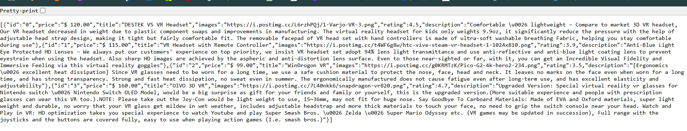
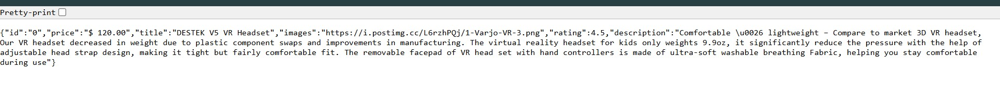

# product_app

A new Flutter project.


## Screenshots

<div style="display: flex; flex-wrap: wrap; gap: 10px;">
  
  
  
  
  
    
    
</div>

```plaintext
product_app/
│
├── android/              # Android-specific files
│
├── ios/                  # iOS-specific files
│
├── lib/                  # Main source code directory
│   ├── models/
          ├──  product.dart 
│   ├── services/
          ├── api_service.dart    # API services
│   ├── screens/
           ├── home_screen.dart              
           ├── product_details_screen.dart               
│   ├── widgets/
          ├── product_card.dart    # Reusable widgets
│   ├── main.dart         # Main entry point
│   └── ...               # Other Dart files
│
├── test/                 # Unit and widget tests
│
├── pubspec.yaml          # Flutter package configuration file
│
├── README.md             # Project documentation
│
└── ...                   # Other configuration files (like .gitignore)
